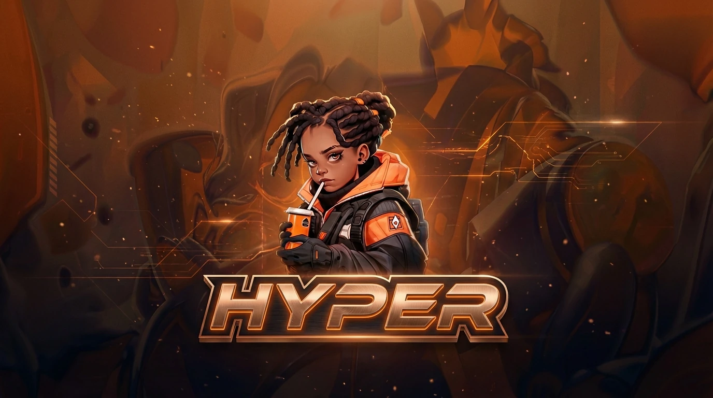

# Hyper Launcher



**Hyper** is the official game launcher and auto-updater for the Cosmicrafts ecosystem. Built with Electron, it provides a seamless, secure, and cinematic entry point into the World of Unreal's flagship digital experiences.

## 🚀 Key Features

- **⚡ Instant Updates:** Automated differential updates ensure you're always running the latest version without manual downloads.
- **🛡️ Secure Architecture:** Uses Electron's best practices (`contextBridge`, `contextIsolation`) to ensure a safe execution environment.
- **✨ Cinematic UI:** A premium, dark-themed interface with glassmorphic elements and high-fidelity animations.
- **🌍 Cross-Platform:** Support for Windows, macOS, and Linux out of the box.

## 📥 Installation

```bash
# Clone the repository
git clone https://github.com/worldofunreal/Hyper.git
cd Hyper

# Install dependencies
npm install

# Start the launcher
npm start
```

## 🛠️ Build & Distribution

Hyper uses `electron-builder` for packaging:

```bash
# Package for the current platform
npm run pack

# Build production installers
npm run dist
```

## 🏗️ Technical Overview

- **Frontend:** HTML5, CSS3 (Glassmorphism), JavaScript.
- **Backend:** Electron (Node.js).
- **Update Logic:** Custom HTTPS-based version check and zip extraction protocol.
- **Security:** Preload injection for secure IPC communication.

## 📄 License

MIT – Part of the **World of Unreal** open-source initiative.
