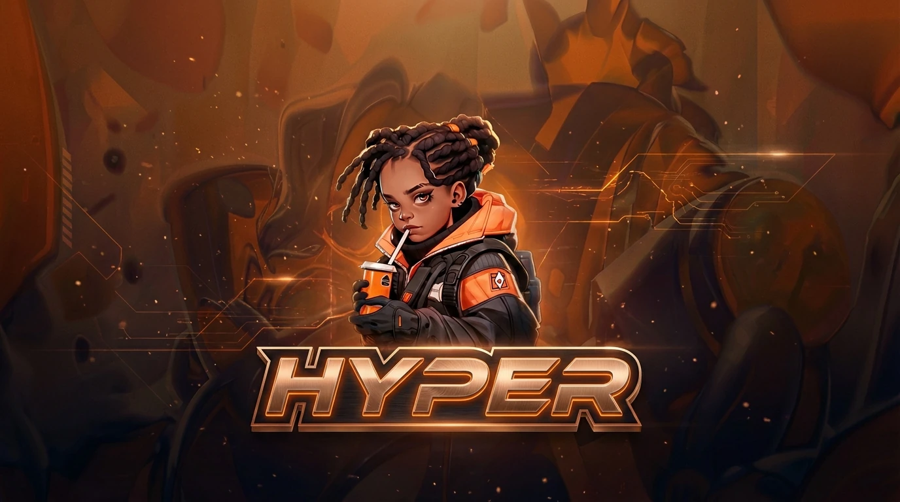

# Hyper 2.0 — World of Unreal game launcher

> **Game launcher.** Pure TypeScript Electron, zero legacy JS. Identity is [`@wou-id`](https://github.com/worldofunreal/../wou-id) (not ICP canisters alone), all IC Hub features ported to wou-id.



---

## What it is

- **Sidebar**: Games / Social / News / Shop
- **Library**: Cosmicrafts / Shadows of War / NFTropoly — each backed by its `version.json`, with download/progress/launch (ported from original `updateLogic.js:1` but rewritten in TS)
- **Social**: player search (`GET /api/v1/user/search`), clans (`/clans/*`), follow graph (`/social/follow`), global feed (`/social/feed`) — all wou-id, all REST now, WS next
- **Identity**: wou-id first — `anonymous` guest → email OTP (Stalwart) → social OAuth hub (`worldofunreal.com/auth/callback`) → web3 (EVM/Solana/ICP via wou-id challenge/verify). No ICP `ChatSDK` canisters in the hot path.

## Stack

- **Electron 33 + electron-vite 2.3 + Vite 5 + React 18 + Tailwind 3 + TypeScript 5.7**
- **Main**: `src/main/index.ts` (BrowserWindow 1280x800, contextIsolation, electron-store session) + `src/main/ipc/auth.ts` (wou-id proxy) + `src/main/ipc/launcher.ts` (TS port of `updateLogic.js`)
- **Preload**: `src/preload/index.ts` — `window.hyper` via `contextBridge` (whitelisted IPC only)
- **Renderer**: `src/renderer/src/{App,Screens,Components,lib/wou.ts}` — wou client is Electron-aware (uses `window.hyper.proxy` when available, falls back to fetch)

## wou-id mapping (IC Hub → wou-id)

| IC Hub (Motoko/ICP) | Hyper 2.0 (wou-id) |
|---|---|
| 4 wallets (II/Stoic/Plug/Infinity) + `projects1.json` | 9 providers (email/discord/google/twitter/meta/evm/sol/icp/passkey + anonymous) + `clans/list` + `inventory` |
| `ChatSDK` groups/DMs (canisters) | `social/feed` + `activity` (REST poll 8s, WS planned) |
| `social/follow` manual | `wou-id /social/follow|unfollow|graph` |
| Separate II canister `oqnbw-faaa...` | Single `id.worldofunreal.com` + hub callback `worldofunreal.com/auth/callback` |

## Run

```bash
npm install
npm run dev      # electron-vite dev with HMR
npm run build    # electron-vite build -> out/
npm run dist     # electron-builder (AppImage/dmg/NSIS)
npm run typecheck
```

## Catalog (add a game)

Edit `src/main/ipc/launcher.ts:14` `CATALOG` — add `{ versionUrl, dirName, execMap: { darwin, win32, linux } }`. It auto-appears in Library.

```ts
'my-game': {
  versionUrl: 'https://my.game/version.json',
  dirName: 'MyGame',
  execMap: { darwin: 'MyGame.app', win32: 'MyGame/MyGame.exe', linux: 'MyGame/MyGame.x86_64' }
}
```

Version json shape per platform: `{ "Mac": { "version":"1.2.3","url":"https://...zip" }, "Windows": {...}, "Linux": {...} }`

## Why from-zero

Original Hyper `src/main/main.js:1` + `updateLogic.js:1` + `preload.js:1` + `renderer/*` was JS-only Cosmicrafts launcher. Kept the idea (secure contextBridge, zip differential update, per-platform exec) but rewrote everything in TS. No legacy file kept — `src/` was wiped and recreated.

## License

MIT — World of Unreal
